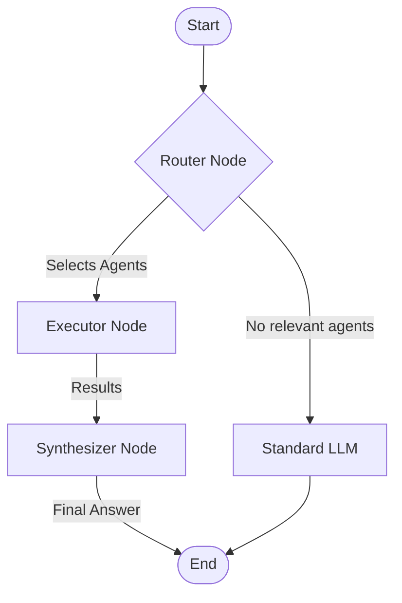

# Backend Architecture & Agent Flow

## High-Level Overview

The backend is built with **FastAPI** and uses **LangGraph** for agent orchestration. It follows a **Router-Executor-Synthesizer** pattern to handle complex user requests while allowing for standard chat capabilities.

### Core Components

1.  **Unified Endpoint** (`/api/chat/stream`): The single entry point for all chat interactions.
2.  **LangGraph State**: Shared state object passed between nodes.
3.  **Router Node**: The "Brain" that decides which agents to call.
4.  **Executor Node**: The "Hands" that interact with MCP servers.
5.  **Synthesizer Node**: The "Voice" that formulates the final response.
6.  **MCP Client**: The standard interface for connecting to tools.

---

## The Request Lifecycle

### 1. User Request
The frontend sends a POST request to `/api/chat/stream` with:
*   `content`: "What is the price of Bitcoin?"
*   `model`: "gemini-3-flash-preview"
*   `active_agents`: `["search", "finance"]` (Agents the user *enabled* in the UI)

### 2. The Fork
The endpoint checks `active_agents`:
*   **Case A (No Agents)**: Standard LLM call. The message history is sent directly to Gemini or Claude.
*   **Case B (Agents Enabled)**: The **LangGraph** workflow is triggered.

### 3. The Agent Workflow (LangGraph)



#### Step A: The Router Node (Decision Making)
*   **Input**: User query and the descriptions of *only* the agents the user enabled (`search`, `finance`).
*   **Logic**: An internal LLM (Gemini Flash) analyzes the query.
*   **Output**: A JSON decision:
    ```json
    {
      "active_agents": ["search"],
      "mode": "parallel"
    }
    ```
    *Note: Even if 5 agents are enabled, the Router might only pick 1, or 0 if none are relevant.*

#### Step B: The Executor Node (Action)
*   **Logic**: Iterates through the `active_agents` list selected by the Router.
*   **Mechanism**: Uses `MCPClient` to call the external Model Context Protocol (MCP) servers.
    *   *Multiple Agents*: If multiple are selected (e.g., "search" and "finance"), they are executed in the mode specified (currently sequential loop, but designed for parallel).
*   **Output**: A list of results:
    ```json
    [
      {"agent": "search", "data": "Bitcoin is $98,000...", "citations": [...]}
    ]
    ```

#### Step C: The Synthesizer Node (Response)
*   **Logic**: Takes the raw data from the Executor and the original user query.
*   **Action**: Constructs a prompt telling the LLM to "Answer the user's question using these results."
*   **Output**: A stream of text tokens (the final answer) and citations.

### 4. Fallback Mechanism
If the Router decides no agents are needed (returns empty list) OR if the agents fail to return data:
*   The system acts as a safety net.
*   It reverts to the **Standard LLM** flow, ensuring the user always gets a conversation response instead of silence.

---

## Handling Multiple Agents

When multiple agents are selected (e.g., User enables `Search`, `Code`, and `Data`):

1.  **Discovery**: The Router is aware of all 3.
2.  **Selection**: If the user asks "Search for Tesla stock and plot the data", the Router selects `["search", "data"]`.
3.  **Execution**:
    *   The Executor calls `Search` -> gets text results.
    *   The Executor calls `Data` -> gets plotting code or data points.
4.  **Synthesis**: The Synthesizer receives *both* outputs. It combines them into one coherent answer: "Here is the stock price from Search, and here is the plot generated by the Data agent."

This modular architecture allows "stacking" skills without the agents needing to know about each other.
